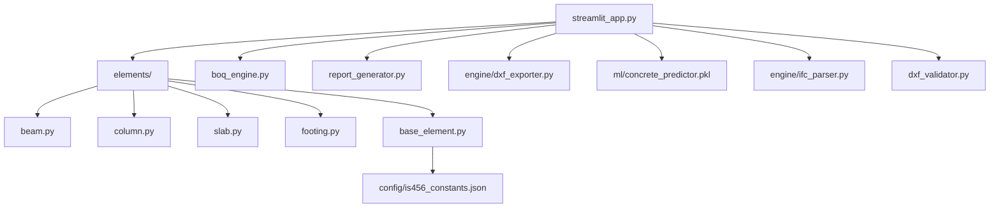

# 🏗️ IS 456 Design Verifier — Enterprise Edition

[](https://github.com/nikeanan/IS456-Design-Verifier/actions/workflows/ci.yml)
[](https://github.com/nikeanan/IS456-Design-Verifier/actions/workflows/lint.yml)
[](https://www.python.org/)
[](https://bis.gov.in/)
[](https://streamlit.io/)

A **production-grade structural engineering verification tool** built to check RC structural elements against the **IS 456:2000** (Plain and Reinforced Concrete) Indian Standard code. Features a real ML-based concrete strength predictor, automated CAD/DXF export, PDF report generation, BIM (IFC) integration, and a batch processing engine.

---

## ✨ Features

| Feature | Details |
|---|---|
| **RC Beam Verification** | Flexure (Annex G1.1), Shear (Cl.40–41), Deflection (Cl.23.2), Min/Max steel, Side-face rebar (Cl.26.5.1) |
| **RC Column Verification** | Slenderness (Cl.25.1.2), P-M Biaxial Interaction (Cl.39.6), Steel limits & tie spacing (Cl.26.5.3) |
| **RC Slab Verification** | One-way/Two-way classification (Annex D), Min rebar (Cl.26.5.2.1), Max spacing (Cl.26.3.3), Strip flexure |
| **Isolated Footing** | Bearing pressure (Cl.34.4), Punching shear (Cl.31.6), One-way shear, Development length (Cl.26.2) |
| **ML Concrete Predictor** | GradientBoostingRegressor — R²=0.87, MAE=4.3 MPa — predicts 28-day f_ck from mix proportions |
| **PDF Report Generator** | Full IS 456 calculation trail in downloadable PDF |
| **CAD DXF Export** | AutoCAD-compatible cross-section drawings (Beam & Column) |
| **BIM IFC Integration** | Structural model extraction from IFC files |
| **Batch CSV Processor** | Verify hundreds of elements in one upload |
| **GitHub Actions CI/CD** | Automated pytest + Ruff lint on every push |

---

## 🏗️ Architecture



---

## 🚀 Quick Start

### Option A — Conda (recommended)

```bash
# 1. Clone
git clone https://github.com/nikeanan/IS456-Design-Verifier.git
cd IS456-Design-Verifier

# 2. Create + activate conda env
conda create -n design_env python=3.10 -y
conda activate design_env

# 3. Install dependencies
pip install -r requirements.txt

# 4. Train ML model (one-time)
python ml/train_model.py

# 5. Launch the app
streamlit run streamlit_app.py
```

### Option B — pip venv

```bash
python -m venv venv
venv\Scripts\activate     # Windows
pip install -r requirements.txt
python ml/train_model.py
streamlit run streamlit_app.py
```

Open **http://localhost:8501** in your browser.

---

## 🧪 Running Tests

```bash
pytest tests/ -v --tb=short
```

Expected output: **all tests passed, 0 failures, 0 warnings**.

---

## 📁 Project Structure

```
IS456-Design-Verifier/
├── streamlit_app.py          # Main Streamlit UI
├── requirements.txt          # Dependencies
├── elements/
│   ├── base_element.py       # Abstract base + config loader
│   ├── beam.py               # RCBeamVerifier (IS 456 Cl.26.5, Annex G)
│   ├── column.py             # RCColumnVerifier (Cl.25, 39.5/39.6)
│   ├── slab.py               # RCSlabVerifier (Annex D, Cl.26.5.2)
│   └── footing.py            # RCFootingVerifier (Cl.34, 31.6)
├── engine/
│   ├── dxf_exporter.py       # CAD cross-section DXF generator
│   └── ifc_parser.py         # BIM IFC extractor
├── ml/
│   ├── train_model.py        # GBR training script
│   └── concrete_predictor.pkl# Trained model (generated)
├── config/
│   └── is456_constants.json  # IS 456 code constants
├── tests/
│   └── test_structural.py    # pytest suite (40+ tests)
├── boq_engine.py             # Bill of Quantities calculator
├── report_generator.py       # fpdf2 PDF report generator
├── dxf_validator.py          # ezdxf DXF analysis engine
├── visualizer.py             # matplotlib cross-section visualizer
└── .github/
    └── workflows/
        ├── ci.yml            # pytest CI pipeline
        └── lint.yml          # Ruff linting pipeline
```

---

## 📐 IS 456:2000 Checks Implemented

### RC Beam
- ✅ Cl. 26.5.1.1 — Minimum tension steel (`Ast_min = 0.85bd/fy`)
- ✅ Cl. 26.5.1.2 — Maximum tension steel (`Ast_max = 0.04bD`)
- ✅ Cl. 26.5.1.3 — Side-face reinforcement (D > 750 mm)
- ✅ Annex G1.1 — Flexure (under/over-reinforced)
- ✅ Cl. 40 & 41 — Shear and stirrup design
- ✅ Cl. 23.2 — Deflection (L/d with modification factor)

### RC Column
- ✅ Cl. 26.5.3.1 — Longitudinal steel limits (0.8%–6%)
- ✅ Cl. 26.5.3.2 — Lateral tie diameter and spacing
- ✅ Cl. 25.1.2 — Slenderness ratio (Short vs Long)
- ✅ Cl. 25.4 — Minimum eccentricity
- ✅ Cl. 39.5/39.6 — P-M Biaxial Interaction

### RC Slab
- ✅ Annex D — One-way vs Two-way classification
- ✅ Cl. 26.5.2.1 — Minimum reinforcement (0.12%/0.15%)
- ✅ Cl. 26.3.3 — Maximum bar spacing (min 3d, 300 mm)
- ✅ Cl. 24.1 — Deflection (span/depth with F_t)
- ✅ Annex G — Strip flexure

### Isolated Footing
- ✅ Cl. 34.3 — Minimum base reinforcement
- ✅ Cl. 34.4 — Bearing pressure at column-footing interface
- ✅ Cl. 26.2 — Development length of column bars
- ✅ Cl. 34.2.3.2 — Bending moment at column face
- ✅ Cl. 31.6 — Two-way (punching) shear
- ✅ Cl. 34.2.4 — One-way shear

---

## 🤖 ML Concrete Strength Predictor

The predictor uses a **GradientBoostingRegressor** trained on 2,000 synthetic concrete mix samples modelled on IS 456:2000 mix design principles (Abrams law):

| Metric | Value |
|---|---|
| Model | GradientBoostingRegressor (n=400, depth=5) |
| R² Score | 0.87 |
| MAE | ~4.3 MPa |
| Features | Cement, Water, Fine Agg., Coarse Agg., RFA%, Curing Days |

Run `python ml/train_model.py` to regenerate the model locally.

---

## 🛡️ License

MIT License — see [LICENSE](LICENSE) for details.

---

## 📧 Contact

Built and maintained by the IS456 Engineering Team.  
Issues and PRs welcome!
